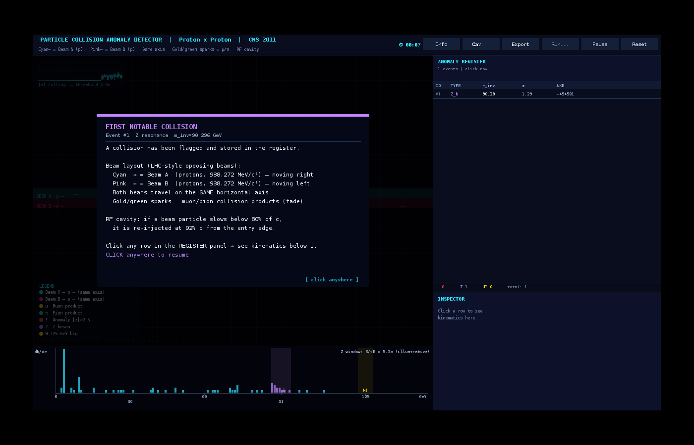
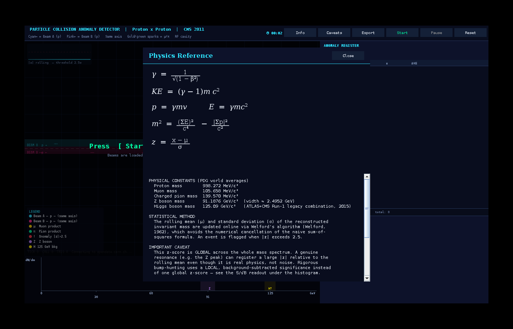

# Particle Collision Anomaly Detector

A Java/Swing simulation of an LHC-style event pipeline: relativistic particle
collisions, invariant-mass reconstruction, and real-time statistical anomaly
detection — modeled on how CERN's Large Hadron Collider filters roughly a
billion collisions per second down to the handful worth a physicist's
attention.

Originally built as an end-of-semester Object-Oriented Programming project at
NUST.



<sub>Live simulation with a flagged Z-boson candidate, real-time histogram, and S/√B significance readout.</sub>


## What it does

- Simulates two opposing proton beams colliding on a shared axis, with an
  RF-cavity-style re-injection when a particle's speed decays.
- Resolves each collision using **full relativistic kinematics** — Lorentz
  factors, 4-momentum conservation, boost to and from the center-of-momentum
  frame.
- Reconstructs the **invariant mass** of each collision the way a real
  detector would: $m^2 = (\Sigma E)^2/c^4 - |\Sigma \vec{p}|^2/c^2$.
- Streams **real CMS dimuon data** live from CERN's Open Data Portal
  (`opendata.cern.ch/record/545`), falling back to a synthetic spectrum if
  offline.
- Scores each event with a live **z-score**, computed via **Welford's
  online algorithm** for numerically stable streaming mean/variance —
  flagging statistically unusual events (`|z| > 2.5`) as they happen.
- Applies basic detector realism: ±2% resolution smearing and a modeled
  trigger efficiency, so not every collision is "perfectly" seen.
- Shows a live **S/√B significance estimate** for the Z window under the
  histogram — an illustrative first-pass bump-hunting statistic (signal
  count vs. sideband-estimated background), clearly labeled as such rather
  than a substitute for a proper fit.
- Renders it all live: particle motion, a mass histogram, an event register,
  a per-event kinematic inspector, and CSV export of flagged events.

## The physics

**Lorentz factor**

$$\gamma = \frac{1}{\sqrt{1 - \beta^2}}$$

**Kinetic energy**

$$KE = (\gamma - 1)\, m c^2$$

**Momentum**

$$p = \gamma m v$$

**Invariant mass**

$$m^2 = \frac{(\Sigma E)^2}{c^4} - \frac{|\Sigma \vec{p}\,|^2}{c^2}$$

**Anomaly score**

$$z = \frac{x - \mu}{\sigma}$$

where $\mu$ and $\sigma$ are the rolling mean and standard deviation,
computed online via Welford's algorithm.

These are typeset from scratch inside the app (Swing has no native LaTeX
renderer) via a small hand-rolled math layout engine — real fractions,
italic variables, proper superscripts — available any time from the **Info**
button:




## Running it

Requires JDK 17+.

```bash
javac src/ParticleSimulation.java -d out
java -cp out ParticleSimulation
```

The app tries to fetch real CMS Open Data on startup; if there's no network
access it automatically falls back to a synthetic mass spectrum, so it runs
fine offline.

## Known limitations / next steps

- The z-score is computed **globally** across the whole mass spectrum, so a
  real resonance peak (e.g. the Z boson) can still register as statistically
  unusual relative to the rolling mean even though it's a genuine physical
  feature, not noise. The S/√B readout is a step toward a **local**
  significance, but a proper version would use a **background-subtracted
  fit**, not a global z-score or a simple sideband count.
- The Z-boson and Higgs-window classifications are simple mass-window cuts,
  not a discovery-grade signal-vs-background fit with a reported
  significance and a look-elsewhere-effect correction (the way an actual
  discovery claim works).
- The originally proposed `PhysicsLaw` interface (for polymorphic
  `MomentumConservation` / `EnergyConservation` implementations) didn't fully
  make it into the shipped class structure — the physics is currently inline
  in the collision-resolution method. A refactor to restore that
  polymorphism is a natural next step.
- No unit tests yet. Adding JUnit tests that assert energy/momentum
  conservation within tolerance would give the physics engine's correctness
  something firmer than "looks right" — particularly valuable now that the
  inelastic-collision handling was rewritten specifically to preserve exact
  momentum conservation; a regression test would lock that in.
- Trigger efficiency and resolution smearing are still flat, illustrative
  placeholders rather than the pT/η-dependent curves a real detector has.

**Fixed and verified:** inelastic collisions now conserve total momentum
exactly — inelasticity is applied inside the center-of-momentum frame before
boosting back, rather than by rescaling each particle's final velocity
independently (which is not momentum-conserving for relativistic momentum).
Visualized decay-product sprites now sum to the exact required momentum
rather than an approximate directional bias. The mass histogram now spans
the full range needed to actually display the Higgs window at 125 GeV.

## Background

Built as a proposal-to-implementation exercise for an OOP course: the
[original proposal](docs/PROPOSAL.md) sketched a simplified Newtonian model;
the shipped version went considerably further, incorporating real
relativistic mechanics and real collider data.

## Data & attribution

Collision mass data sourced from the [CERN Open Data
Portal](http://opendata.cern.ch/record/545) (CMS Collaboration, dimuon
dataset), used here for educational purposes.

## License

MIT — see [LICENSE](LICENSE). Feel free to fork, adapt, or build on it.
